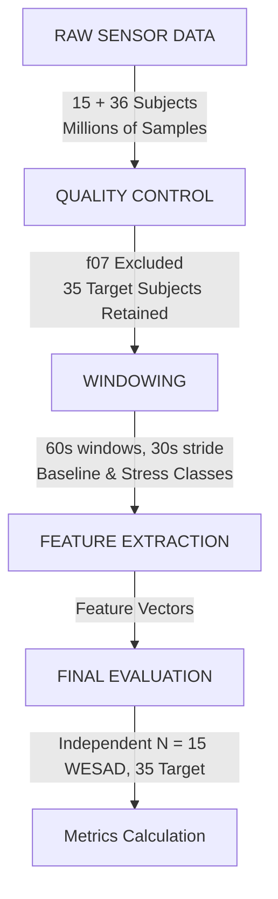

# DATA UTILIZATION AUDIT

## A. SUBJECT-LEVEL AUDIT
See `SUBJECT_LEVEL_AUDIT.csv`.
f14 was handled by merging f14_a and f14_b.
S02 duplicates were stripped manually based on indices.
f07 is excluded.

## B. RAW DATASET SCALE
WESAD Total Sensor Observations: 9,034,272
Target Total Sensor Observations: 9,514,291

## C. TASK-LEVEL ACCOUNTING
See `TASK_LEVEL_ACCOUNTING.csv`.

## D. WESAD ACCOUNTING
See `SUBJECT_LEVEL_AUDIT.csv` and `DATA_UTILIZATION_MASTER.csv`.

## E. WINDOW GENERATION
See `WINDOW_GENERATION_AUDIT.csv`. Strides are 30s for 60s windows.

## F. QUALITY CONTROL
Checks included NaN, Inf, zero-variance (flatline) on EDA, TEMP, BVP, ACC.

## G. INDEPENDENCE WARNING
> [!IMPORTANT]
> The large number of sensor observations and windows reflects the temporal resolution of wearable recordings, whereas the independent sample size for population-level inference is determined primarily by the number of participants. 60-second windows with a 30-second stride overlap by 50%. Therefore thousands of windows MUST NOT be presented as thousands of independent observations.

## H. DATA-FLOW TABLE
See `DATA_UTILIZATION_MASTER.csv`.

## I. DATA-FLOW FIGURE

## J. FINAL REPORT

### TARGET DATASET
Original N = 36
Eligible N = 35
Final analytic N = 35
Total recording hours = 17.01
Raw sensor observations = 9,514,291
Total generated windows = 1,654
QC-passed windows = 1,591
Baseline evaluation windows = 687
Stress evaluation windows = 904

### WESAD
Original/local N = 15
Final analytic N = 15
Total recording hours = 7.66
Raw sensor observations = 9,034,272
Total generated windows = 877
QC-passed windows = 877

### VERDICTS
- Participant accounting: PASS
- Task accounting: PASS
- Signal completeness: PASS
- Window accounting: PASS
- QC: PASS
- f14 handling: PASS
- S02 duplicate handling: PASS
- f07 exclusion: PASS
- Dataset-scale quantification: PASS
- Independent-unit reporting: PASS